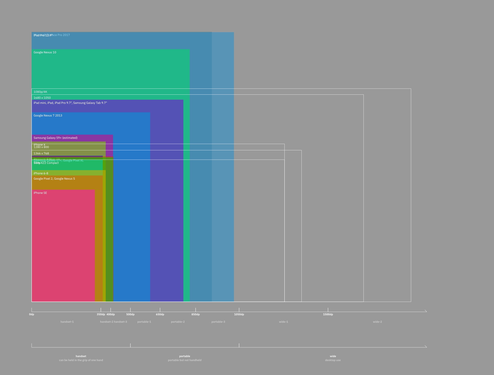
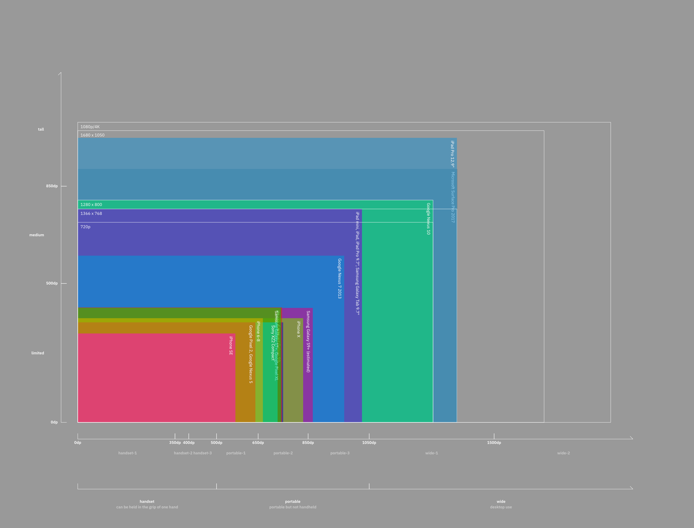

## Display

This is Helium's display boundary stuff.

Because Helium is designed with full-screen software design in mind, screen size boundaries are relatively granular (but can also be more generic if you wish) and are oriented around ergonomic considerations.

The boundaries were developed from researching a lot of different devices' virtual display sizes as would be seen by a web browser.

Due to a quirk in Stylus' handling of @media variables, you have to access display boundary variables from arrays. There are two different arrays, one for width, and one for height.

**sw** (array of width variables)  
ie. `@media sw.handset-3`

**sh**	(array of height variables)  
ie. `@media sh.limited`

### Display width groups

| display bucket | min width | max width | analogues |
|---|--|--|--|
| sw.handset | none | 499px | Handheld devices (ie. phones) |
| sw.portable | 500px | 1049px | Most tablet contexts |
| sw.wide | 1050px | none | Large landscape tablet, laptop, desktop, or TV contexts.  |

### Display width areas

| display bucket | min width | max width | analogues |
|---|--|--|--|
| sw.handset-1 | none | 349px | Small devices that can be held in one hand, and are entirely operable with one hand. |
| sw.handset-2 | 350px | 399px | Medium devices that can be held in one hand, and are mostly (but not completly) operable with one hand. |
| sw.handset-3 | 400px | 499px | Large devices that can be held in one hand, but are not entirely operable with one hand. |
| sw.portable-1 | 500px | 649px | Small tablets. Narrow desktop windows. |
| sw.portable-2 | 650px | 849px | Regular tablets (ie. iPad 9.7") in portrait, Small desktop windows. |
| sw.portable-3 | 850px | 1049px | Large tablets in portrait. Small and regular tablets in landscape. 1024x768. |
| sw.wide-1 | 1050px | 1499px | Large tablets in landscape and laptops. 720p, 1366x768, 1280x800.  |
| sw.wide-2 | 1500px | none | Desktop and other large displays. 1680x1050, 1080p/4K. |

### Display height groups

| display bucket | min height | max height | analogues |
|---|--|--|--|
| sh.limited | none | 499px | Handheld devices (ie. phones) in landscape. The amount of vertical space is very limited. |
| sh.medium | 500px | 849px | Small and regular tablets in landscape. The amount of vertical space is restricted. |
| sh.tall | 850px | none | Large landscape tablet, laptop or desktop contexts. The amount of vertical space is ample. |

---

### Device examples:

##### Small handheld devices (<4.5")
Apple iPhone SE.

##### Medium handheld devices (4.5 - 5")
Apple iPhone 6-8, Apple iPhone X, Google Pixel, Samsung Galaxy phones, Sony Xperia XZ2 Compact.

##### Large handheld devices (5 - 6.5")  
Apple iPhone 6-8 Plus, Google Pixel XL, Samsung Galaxy S6+ onwards, Samsung Galaxy Note, Sony Xperia XZ2.

##### Small tablets (7 - 8")
Nexus 7, NVIDIA SHIELD, most tablets between 7 and 8".
  
##### Regular tablets (8 - 10")
iPad 9.7", iPad mini, Samsung Galaxy Tab, Nexus 10, Nexus 9, Pixel C, most tablets between 8 and 10".

##### Large tablets (>10")
iPad Pro 12.9", Surface Pro, most tablets larger than 10".

---
